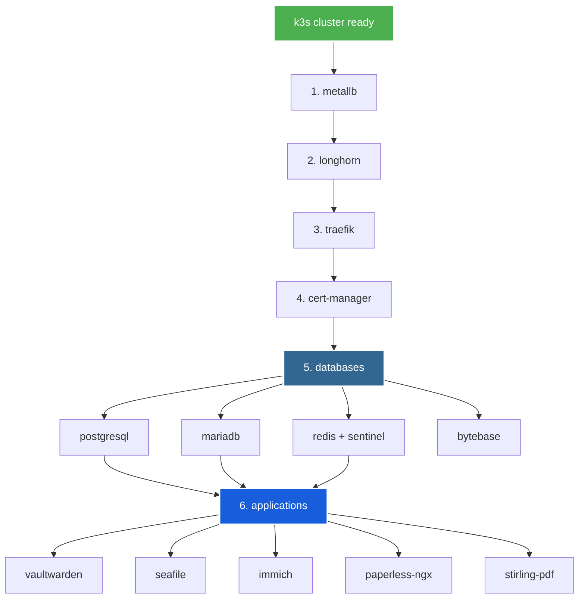

# k3s infrastructure deployment guide

> step-by-step deployment procedures for all services

## 📋 deployment order overview



## 🚀 new services quick start

### immich - photo & video management

```bash
# 1. create postgresql database
psql -h postgres-cluster-rw.database.svc.cluster.local -U postgres
CREATE DATABASE immich;
CREATE USER immich WITH PASSWORD 'secure_password';
GRANT ALL PRIVILEGES ON DATABASE immich TO immich;
ALTER DATABASE immich OWNER TO immich;
\q

# 2. configure secrets
cd immich
# edit secrets.yaml with real passwords
kubectl apply -f secrets.yaml

# 3. create persistent storage
kubectl apply -f pvc.yaml

# 4. deploy immich with helm (uses existing pvcs)
helm repo add immich https://immich-app.github.io/immich-charts
helm repo update
helm install immich immich/immich -n app-internal -f values.yaml

# 5. setup tls and routing
kubectl apply -f certificate.yaml
kubectl apply -f route.yaml

# 6. verify
kubectl get pods -n app-internal -l app.kubernetes.io/name=immich
helm list -n app-internal
# access: https://photos.mikey-liang.com
```

### paperless-ngx - document management

```bash
# 1. create postgresql database
psql -h postgres-cluster-rw.database.svc.cluster.local -U postgres
CREATE DATABASE paperless;
CREATE USER paperless WITH PASSWORD 'secure_password';
GRANT ALL PRIVILEGES ON DATABASE paperless TO paperless;
ALTER DATABASE paperless OWNER TO paperless;
\q

# 2. configure secrets
cd paperless-ngx
# edit secrets.yaml with passwords and secret key
openssl rand -base64 32  # generate secret key
kubectl apply -f secrets.yaml

# 3. deploy paperless with helm (creates pvcs automatically)
helm repo add gabe565 https://charts.gabe565.com
helm repo update
helm install paperless-ngx gabe565/paperless-ngx -n app-internal -f values.yaml

# 4. setup tls and routing
kubectl apply -f certificate.yaml
kubectl apply -f route.yaml

# 5. verify
kubectl get pods -n app-internal -l app.kubernetes.io/name=paperless-ngx
helm list -n app-internal
# access: https://docs.mikey-liang.com
# login: admin / (password from secrets)
```

### stirling-pdf - pdf manipulation

```bash
# simple deployment - no database required

cd stirling-pdf

# 1. deploy stirling-pdf with helm (creates pvc automatically)
helm repo add stirling-pdf https://stirling-tools.github.io/Stirling-PDF-chart
helm repo update
helm install stirling-pdf stirling-pdf/stirling-pdf-chart -n app-internal -f values.yaml

# 2. setup tls and routing
kubectl apply -f certificate.yaml
kubectl apply -f route.yaml

# 3. verify
kubectl get pods -n app-internal -l app.kubernetes.io/name=stirling-pdf-chart
helm list -n app-internal
# access: https://pdf.mikey-liang.com
```

## 📊 service endpoints

| service | url | purpose | dependencies |
|---------|-----|---------|--------------|
| **immich** | https://photos.mikey-liang.com | photo/video management | postgresql, redis |
| **paperless-ngx** | https://docs.mikey-liang.com | document management | postgresql, redis |
| **stirling-pdf** | https://pdf.mikey-liang.com | pdf manipulation | none |

## 💾 storage requirements

| service | total storage | breakdown |
|---------|---------------|-----------|
| **immich** | 520gb | 500gb library + 20gb ml cache |
| **paperless-ngx** | 320gb | 200gb media + 100gb data + 20gb consume |
| **stirling-pdf** | 10gb | configs & temp files |
| **total** | **850gb** | additional longhorn storage needed |

## 🔑 credentials checklist

### immich
- [ ] postgresql password
- [ ] redis password (shared)
- [ ] initial admin account (create via web ui)

### paperless-ngx
- [ ] postgresql password
- [ ] redis password (shared)
- [ ] admin password
- [ ] secret key (32 char random)

### stirling-pdf
- [ ] no credentials needed (optional: enable auth in values.yaml later)

## ✅ post-deployment verification

```bash
# check all new services
kubectl get pods -n app-internal | grep -E "immich|paperless|stirling"

# check helm releases
helm list -n app-internal

# check certificates
kubectl get certificate -n app-internal

# check routes
kubectl get httproute -n app-internal

# check pvcs (created by helm and kubectl)
kubectl get pvc -n app-internal | grep -E "immich|paperless|stirling"
```

## 🔧 troubleshooting

### pods not starting

```bash
# check pod status
kubectl describe pod <pod-name> -n app-internal

# check logs
kubectl logs <pod-name> -n app-internal -f

# common issues:
# - imagepullbackoff: check image names
# - crashloopbackoff: check database connectivity
# - pending: check pvc binding
```

### database connection failures

```bash
# test postgresql connection
kubectl run -it --rm psql-test --image=postgres:16 --restart=Never -- \
  psql -h postgres-cluster-rw.database.svc.cluster.local -U <username> -d <database>

# check secrets
kubectl get secret <secret-name> -n app-internal -o yaml
```

### certificate issues

```bash
# check certificate status
kubectl describe certificate <cert-name> -n app-internal

# check cert-manager logs
kubectl logs -n cert-manager -l app=cert-manager --tail=50

# force renewal
kubectl delete certificate <cert-name> -n app-internal
kubectl apply -f <service>/certificate.yaml
```

## 📚 detailed documentation

- [immich/README.md](immich/README.md) - complete immich setup guide
- [paperless-ngx/README.md](paperless-ngx/README.md) - paperless operations
- [stirling-pdf/README.md](stirling-pdf/README.md) - pdf tools usage

## 🎯 next steps

after deploying:

1. **configure backups** for postgresql databases
2. **setup longhorn snapshots** for pvcs
3. **enable monitoring** (optional)
4. **configure mobile apps** for immich
5. **setup document scanning** for paperless-ngx
6. **test pdf operations** in stirling-pdf

