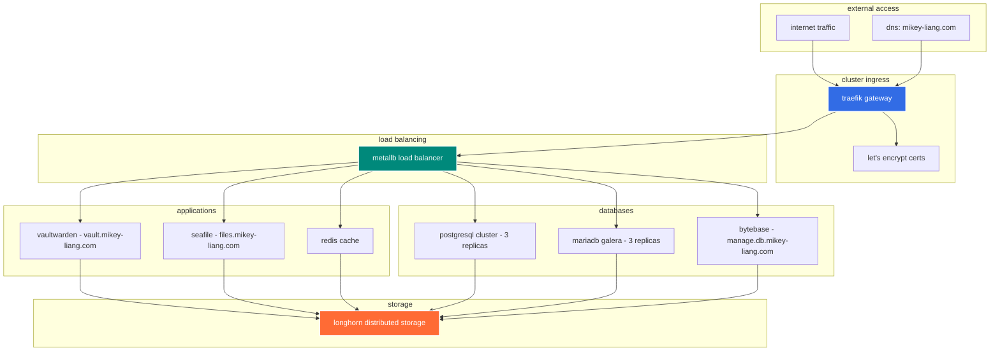
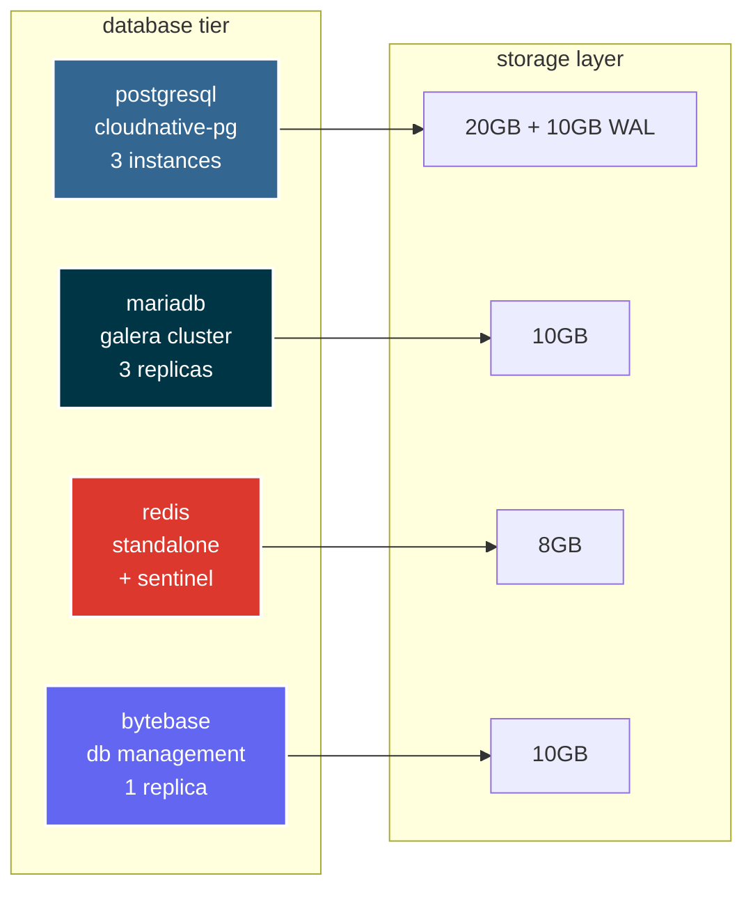
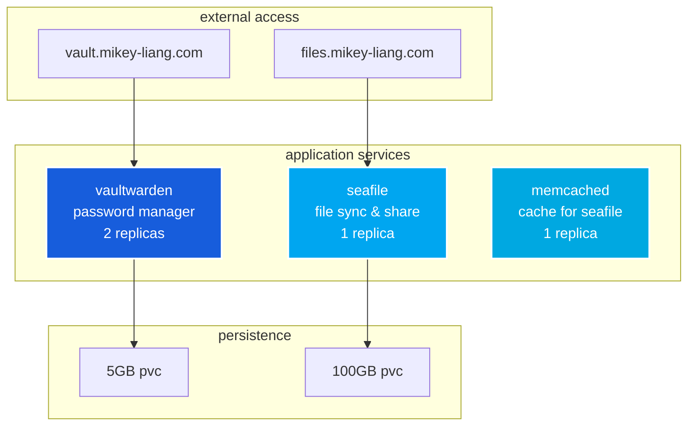
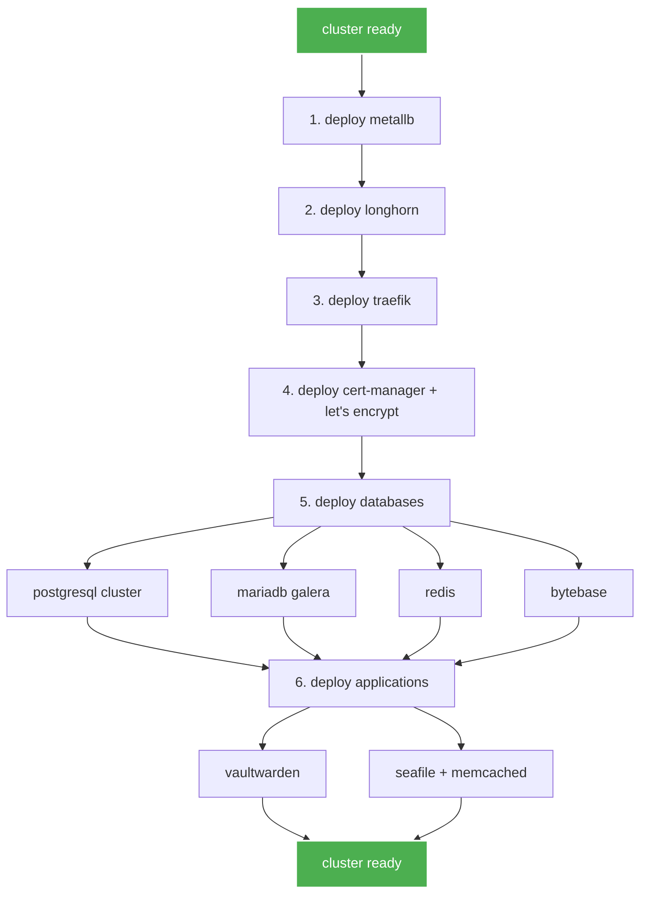

# k3s infrastructure

> lightweight kubernetes infrastructure for self-hosted services

## 📋 overview

this repository contains kubernetes manifests and helm values for a production-ready k3s cluster running databases, storage, and internal applications.

### architecture



## 🏗️ infrastructure components

### networking & load balancing

| component | type | purpose | namespace |
|-----------|------|---------|-----------|
| **traefik** | ingress gateway | routes external traffic, tls termination | kube-system |
| **metallb** | load balancer | provides loadbalancer ips for services | metallb-system |
| **let's encrypt** | tls certificates | automatic ssl certificate management | cert-manager |

### storage

| component | type | storage class | purpose |
|-----------|------|---------------|---------|
| **longhorn** | distributed storage | longhorn | replicated block storage across nodes |

### databases



| service | type | replicas | storage | namespace | endpoint |
|---------|------|----------|---------|-----------|----------|
| **postgresql** | cloudnative-pg | 3 | 20gi + 10gi wal | database | postgres-cluster |
| **mariadb** | galera cluster | 3 | 10gi | database | mariadb-galera |
| **redis** | bitnami | 1 | 8gi | database | redis-master |
| **bytebase** | statefulset | 1 | 10gi | database | https://manage.db.mikey-liang.com |

### applications



| application | purpose | storage | namespace | url |
|-------------|---------|---------|-----------|-----|
| **vaultwarden** | password manager | 5gi | app-internal | https://vault.mikey-liang.com |
| **seafile** | file sync & share | 100gi | app-internal | https://files.mikey-liang.com |
| **memcached** | seafile cache | - | app-internal | internal only |

## 🗂️ repository structure

```
k3s-infra/
├── k3s/                    # cluster setup
│   ├── k3s-network.yaml    # network configuration
│   └── k3s-worker.yaml     # worker node config
│
├── metallb/                # load balancer
│   └── ip_pool.yaml        # ip address pools
│
├── traefik/                # ingress gateway
│   └── values.yaml         # helm values
│
├── lets-encrypt/           # tls certificates
│   ├── issuer.yaml         # cert issuer config
│   └── certificate.yaml    # certificate templates
│
├── longhorn/               # distributed storage
│   ├── longhorn-values.yaml
│   └── longhorn-mountvolume.sh
│
├── postgres/               # postgresql cluster
│   └── values.yaml         # cloudnative-pg config
│
├── mariadb/                # mariadb galera cluster
│   ├── mariadb-galera.yaml
│   └── mariadb-bytebase-user.yaml
│
├── redis/                  # redis cache
│   ├── pvc.yaml           # persistent volume claim
│   ├── values.yaml        # helm values
│   └── route.yaml         # gateway route
│
├── bytebase/              # database management
│   ├── values.yaml        # statefulset config
│   ├── service.yaml       # service definition
│   ├── certificate.yaml   # tls certificate
│   └── route.yaml         # gateway route
│
├── vaultwarden/           # password manager
│   ├── pvc.yaml          # persistent volume claim
│   ├── values.yaml       # helm values
│   ├── certificate.yaml  # tls certificate
│   └── route.yaml        # gateway route
│
└── seafile/               # file sync & share
    ├── seafile.yaml       # deployment + pvc
    ├── memcached.yaml     # cache deployment
    └── route.yaml         # gateway route
```

## 🚀 deployment guide

### prerequisites

```bash
# k3s cluster installed with:
# - embedded traefik disabled
# - servicelb disabled
# - local storage disabled
curl -sfL https://get.k3s.io | sh -s - server \
  --disable traefik \
  --disable servicelb \
  --disable local-storage
```

### deployment order



#### 1. metallb load balancer

```bash
kubectl apply -f metallb/ip_pool.yaml
```

#### 2. longhorn storage

```bash
helm repo add longhorn https://charts.longhorn.io
helm repo update
helm install longhorn longhorn/longhorn \
  --namespace longhorn-system \
  --create-namespace \
  -f longhorn/longhorn-values.yaml

# optional: run mount volume script on nodes
bash longhorn/longhorn-mountvolume.sh
```

#### 3. traefik gateway

```bash
helm repo add traefik https://traefik.github.io/charts
helm repo update
helm install traefik traefik/traefik \
  --namespace kube-system \
  -f traefik/values.yaml
```

#### 4. let's encrypt certificates

```bash
# install cert-manager first
kubectl apply -f https://github.com/cert-manager/cert-manager/releases/download/v1.13.0/cert-manager.yaml

# configure let's encrypt issuer
kubectl apply -f lets-encrypt/issuer.yaml
kubectl apply -f lets-encrypt/certificate.yaml
```

#### 5. deploy databases

```bash
# postgresql
helm repo add cnpg https://cloudnative-pg.github.io/charts
helm install postgres cnpg/cloudnative-pg \
  --namespace database \
  --create-namespace
kubectl apply -f postgres/values.yaml

# mariadb
kubectl apply -f mariadb/mariadb-galera.yaml
kubectl apply -f mariadb/mariadb-bytebase-user.yaml

# redis
kubectl create namespace database
kubectl apply -f redis/pvc.yaml
helm repo add bitnami https://charts.bitnami.com/bitnami
helm install redis bitnami/redis \
  --namespace database \
  -f redis/values.yaml

# bytebase
kubectl apply -f bytebase/values.yaml
kubectl apply -f bytebase/service.yaml
kubectl apply -f bytebase/certificate.yaml
kubectl apply -f bytebase/route.yaml
```

#### 6. deploy applications

```bash
# vaultwarden
kubectl create namespace app-internal
kubectl apply -f vaultwarden/pvc.yaml
helm repo add vaultwarden https://vaultwarden.github.io/charts
helm install vaultwarden vaultwarden/vaultwarden \
  --namespace app-internal \
  -f vaultwarden/values.yaml
kubectl apply -f vaultwarden/certificate.yaml
kubectl apply -f vaultwarden/route.yaml

# seafile
kubectl apply -f seafile/memcached.yaml
kubectl apply -f seafile/seafile.yaml
kubectl apply -f seafile/route.yaml
```

## 🔒 security

### tls certificates

all external services use let's encrypt certificates with automatic renewal:
- `vault.mikey-liang.com` - vaultwarden
- `files.mikey-liang.com` - seafile
- `manage.db.mikey-liang.com` - bytebase

### secrets management

sensitive credentials are stored in kubernetes secrets:
- database passwords (generated)
- application tokens
- tls certificates (auto-managed)

## 📊 monitoring & maintenance

### storage monitoring

```bash
# check longhorn status
kubectl get pods -n longhorn-system

# view storage usage
kubectl get pvc --all-namespaces
```

### database health

```bash
# postgresql cluster status
kubectl get cluster -n database

# mariadb status
kubectl get mariadb -n database

# redis status
kubectl get pods -n database -l app.kubernetes.io/name=redis
```

## 🛠️ common operations

### scaling applications

```bash
# scale vaultwarden replicas
kubectl scale deployment vaultwarden -n app-internal --replicas=3

# scale postgresql cluster
kubectl patch cluster postgres-cluster -n database \
  --type='json' -p='[{"op": "replace", "path": "/spec/instances", "value": 5}]'
```

### backup & restore

```bash
# postgresql backup (handled by cloudnative-pg)
kubectl get backup -n database

# longhorn snapshots (handled automatically)
kubectl get volume -n longhorn-system
```

### updating applications

```bash
# update vaultwarden
helm upgrade vaultwarden vaultwarden/vaultwarden \
  --namespace app-internal \
  -f vaultwarden/values.yaml

# update redis
helm upgrade redis bitnami/redis \
  --namespace database \
  -f redis/values.yaml
```

## 📝 notes

- all services use longhorn for persistent storage with replication
- postgresql and mariadb run in high-availability mode (3 replicas)
- metallb provides load balancer ips from pool: `10.3.0.0/24`
- traefik handles all external routing and tls termination
- cert-manager automatically renews let's encrypt certificates

## 📄 license

mit - feel free to use this as a template for your own infrastructure

---

**maintained by:** mikey liang  
**last updated:** november 2025
