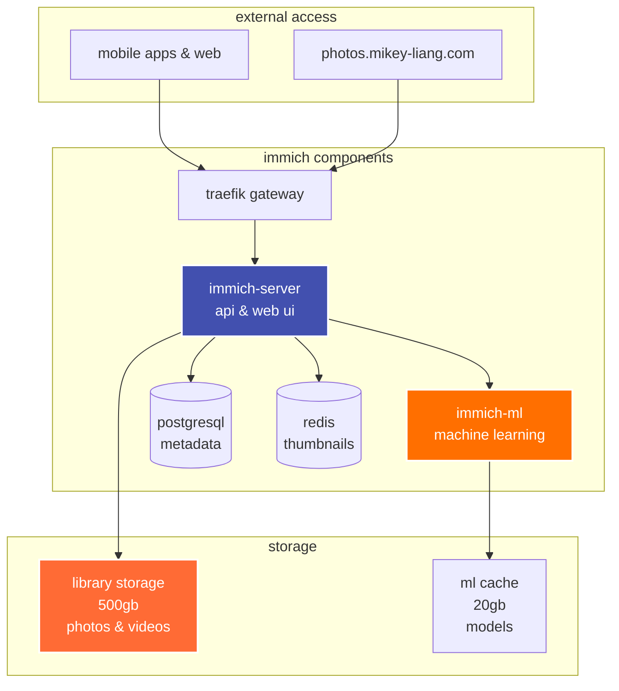
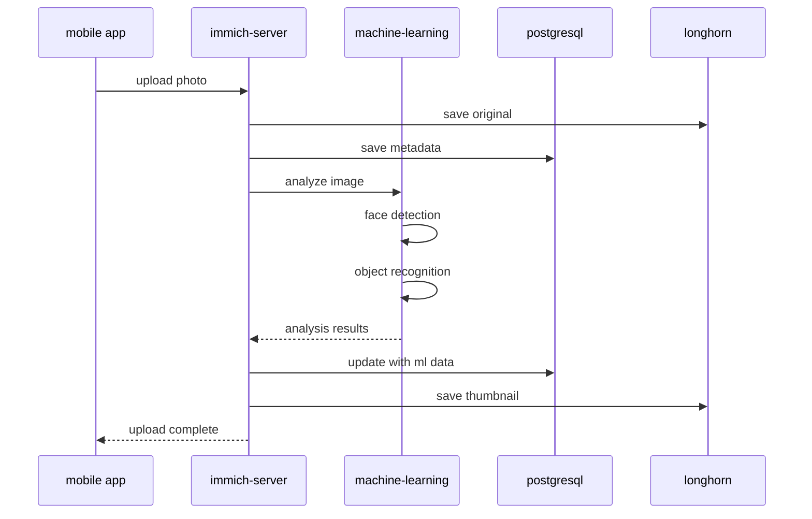

# immich

> self-hosted photo and video management solution with machine learning

## 📋 overview

immich is a high-performance photo and video management platform with automatic backup from mobile devices, facial recognition, and smart search powered by machine learning.

### architecture



## 🚀 deployment

### prerequisites

```bash
# postgresql database
# redis cache
# longhorn storage

# create namespace
kubectl create namespace app-internal
```

### 1. create database and user

```sql
-- connect to postgresql
psql -h postgres-cluster-rw.database.svc.cluster.local -U postgres

-- create database and user
CREATE DATABASE immich;
CREATE USER immich WITH PASSWORD 'secure_password_here';
GRANT ALL PRIVILEGES ON DATABASE immich TO immich;
ALTER DATABASE immich OWNER TO immich;
```

### 2. create secrets

```bash
# edit secrets.yaml with real passwords
kubectl apply -f secrets.yaml
```

### 3. create persistent storage

```bash
# create pvcs before helm install
kubectl apply -f pvc.yaml

# verify pvcs are bound
kubectl get pvc -n app-internal | grep immich
```

### 4. install immich with helm

```bash
# add helm repo
helm repo add immich https://immich-app.github.io/immich-charts
helm repo update

# install immich (references existing pvcs)
helm install immich immich/immich \
  --namespace app-internal \
  -f values.yaml

# wait for pods to be ready
kubectl wait --for=condition=ready pod -l app.kubernetes.io/name=immich \
  -n app-internal --timeout=300s
```

### 5. setup tls and routing

```bash
kubectl apply -f certificate.yaml
kubectl apply -f route.yaml
```

### 6. verify installation

```bash
# check pods
kubectl get pods -n app-internal -l app.kubernetes.io/name=immich

# expected:
# immich-server-xxx         1/1  running
# immich-machine-learning   1/1  running

# check pvcs
kubectl get pvc -n app-internal | grep immich

# check helm release
helm list -n app-internal
```

## 📱 access

**web interface:** https://photos.mikey-liang.com

**mobile apps:**
- ios: app store
- android: play store / f-droid

**initial setup:**
1. navigate to web interface
2. create admin account
3. download mobile app
4. configure server url: `https://photos.mikey-liang.com`
5. login and enable automatic backup

## 🔧 configuration

### storage breakdown

| volume | size | purpose |
|--------|------|---------|
| immich-library | 500gb | photos, videos, thumbnails |
| immich-ml-cache | 20gb | machine learning models |

### resource allocation

| component | cpu request | memory request | cpu limit | memory limit |
|-----------|-------------|----------------|-----------|--------------|
| server | 200m | 512mi | 2000m | 2gi |
| machine-learning | 500m | 1gi | 4000m | 4gi |

### features

- ✅ automatic mobile backup
- ✅ facial recognition
- ✅ object detection
- ✅ smart search
- ✅ shared albums
- ✅ live photos support
- ✅ raw format support
- ✅ video transcoding

## 📊 data flow



## 🛠️ operations

### backup strategy

```bash
# backup postgresql database
kubectl exec -it postgres-cluster-1 -n database -- \
  pg_dump -U immich immich > immich-db-backup.sql

# backup library (use longhorn snapshots)
kubectl get volume -n longhorn-system | grep immich-library
```

### scaling

```bash
# scale server replicas
helm upgrade immich immich/immich \
  --namespace app-internal \
  --set server.replicas=2 \
  -f values.yaml
```

### check logs

```bash
# server logs
kubectl logs -n app-internal -l app=immich-server -f

# ml logs
kubectl logs -n app-internal -l app=immich-machine-learning -f
```

### storage usage

```bash
# check pvc usage
kubectl exec -it <immich-server-pod> -n app-internal -- df -h

# check library size
kubectl exec -it <immich-server-pod> -n app-internal -- \
  du -sh /usr/src/app/upload
```

## 🐛 troubleshooting

### uploads failing

```bash
# check server logs
kubectl logs -n app-internal -l app=immich-server --tail=100

# check pvc space
kubectl describe pvc immich-library -n app-internal

# verify permissions
kubectl exec -it <immich-server-pod> -n app-internal -- ls -la /usr/src/app/upload
```

### machine learning not working

```bash
# check ml pod status
kubectl get pods -n app-internal -l app=immich-machine-learning

# check ml logs
kubectl logs -n app-internal -l app=immich-machine-learning --tail=50

# verify ml cache
kubectl describe pvc immich-ml-cache -n app-internal
```

### database connection issues

```bash
# test postgresql connection
kubectl run -it --rm psql-test --image=postgres:16 --restart=Never -- \
  psql -h postgres-cluster-rw.database.svc.cluster.local -U immich -d immich

# check secrets
kubectl get secret immich-db -n app-internal -o yaml
```

### mobile app won't connect

- verify url: `https://photos.mikey-liang.com`
- check certificate is valid
- verify traefik route is working
- check firewall/dns settings

## 📈 monitoring

### health checks

```bash
# server health
curl -k https://photos.mikey-liang.com/api/server-info/ping

# check all components
kubectl get pods -n app-internal -l app=immich
```

### resource usage

```bash
# view resource consumption
kubectl top pods -n app-internal -l app=immich
```

## 🔄 upgrading

```bash
# update helm repo
helm repo update

# check available versions
helm search repo immich/immich --versions

# upgrade
helm upgrade immich immich/immich \
  --namespace app-internal \
  -f values.yaml

# rollback if needed
helm rollback immich -n app-internal

# check rollout status
kubectl rollout status deployment -l app.kubernetes.io/name=immich -n app-internal
```

## 🔒 security

### best practices

1. **change default passwords** in secrets.yaml
2. **enable 2fa** in immich web ui
3. **regular backups** of database and photos
4. **monitor storage** usage and set alerts
5. **review shared albums** permissions regularly

### external access

- tls certificate via let's encrypt
- traefik handles ssl termination
- optional: add authentication middleware

## 📚 resources

- [immich documentation](https://immich.app/docs)
- [github repository](https://github.com/immich-app/immich)
- [helm chart](https://github.com/immich-app/immich-charts)

