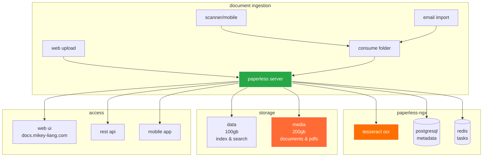
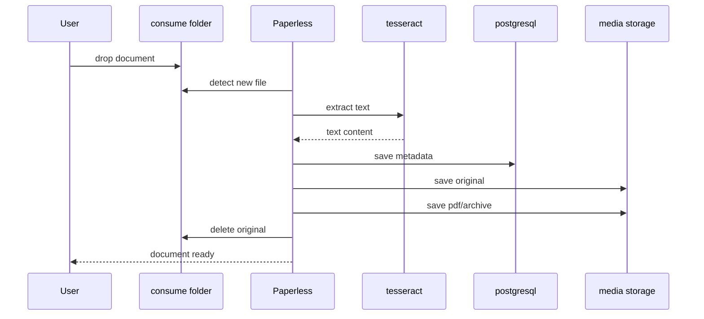

# paperless-ngx

> powerful document management system with ocr and full-text search

## 📋 overview

paperless-ngx scans, indexes, and archives all your documents with automatic ocr, tagging, and full-text search capabilities. perfect for organizing receipts, contracts, invoices, and any paper documents.

### architecture



## 🚀 deployment

### prerequisites

```bash
# postgresql database
# redis cache
# longhorn storage

# create namespace
kubectl create namespace app-internal
```

### 1. create database and user

```sql
-- connect to postgresql
psql -h postgres-cluster-rw.database.svc.cluster.local -U postgres

-- create database and user
CREATE DATABASE paperless;
CREATE USER paperless WITH PASSWORD 'secure_password_here';
GRANT ALL PRIVILEGES ON DATABASE paperless TO paperless;
ALTER DATABASE paperless OWNER TO paperless;
```

### 2. create secrets

```bash
# generate secret key
openssl rand -base64 32

# edit secrets.yaml with:
# - database password
# - admin password
# - secret key (32 char random)

# apply secrets
kubectl apply -f secrets.yaml
```

### 3. install paperless-ngx with helm

```bash
# add helm repo
helm repo add gabe565 https://charts.gabe565.com
helm repo update

# install paperless-ngx (helm creates pvcs automatically)
helm install paperless-ngx gabe565/paperless-ngx \
  --namespace app-internal \
  -f values.yaml

# wait for pod to be ready
kubectl wait --for=condition=ready pod -l app.kubernetes.io/name=paperless-ngx \
  -n app-internal --timeout=300s
```

### 4. setup tls and routing

```bash
kubectl apply -f certificate.yaml
kubectl apply -f route.yaml
```

### 5. verify installation

```bash
# check pod
kubectl get pods -n app-internal -l app.kubernetes.io/name=paperless-ngx

# check logs
kubectl logs -n app-internal -l app.kubernetes.io/name=paperless-ngx -f

# check pvcs (created by helm)
kubectl get pvc -n app-internal | grep paperless

# check helm release
helm list -n app-internal
```

## 📱 access

**web interface:** https://docs.mikey-liang.com

**default login:**
- username: `admin`
- password: (set in secrets.yaml)

**mobile apps:**
- android: paperless mobile on play store
- ios: paperless mobile on app store

## 🔧 configuration

### storage breakdown

| volume | size | purpose |
|--------|------|---------|
| paperless-data | 100gb | database, index, search data |
| paperless-media | 200gb | original documents & pdfs |
| paperless-consume | 20gb | inbox for new documents |

### ocr languages

default: english (`eng`)

**add more languages:**
```yaml
env:
  - name: PAPERLESS_OCR_LANGUAGE
    value: "eng+fra+deu"  # english, french, german
```

### document workflow



## 📄 document ingestion methods

### 1. web upload

- drag & drop files in web ui
- bulk upload supported
- immediate processing

### 2. consume folder

```bash
# mount consume pvc and copy files
kubectl cp document.pdf app-internal/paperless-ngx-xxx:/usr/src/paperless/consume/

# or use samba/nfs share (optional setup)
```

### 3. email import

configure email account to forward receipts/documents

### 4. mobile app

- scan documents with phone camera
- auto-upload to paperless
- ocr on device or server

## 🏷️ features

- ✅ automatic ocr on all documents
- ✅ full-text search across everything
- ✅ custom tags and metadata
- ✅ automatic tagging with ai
- ✅ document versioning
- ✅ email notifications
- ✅ custom workflows
- ✅ rest api for automation
- ✅ multi-user support
- ✅ mobile apps

## 🛠️ operations

### backup strategy

```bash
# backup postgresql database
kubectl exec -it postgres-cluster-1 -n database -- \
  pg_dump -U paperless paperless > paperless-db-backup.sql

# backup media files (use longhorn snapshots)
kubectl get volume -n longhorn-system | grep paperless-media
```

### check processing queue

```bash
# view logs
kubectl logs -n app-internal -l app.kubernetes.io/name=paperless-ngx --tail=100

# check redis queue
kubectl exec -it redis-master-0 -n database -- \
  redis-cli -a <password> LLEN celery
```

### storage usage

```bash
# check pvc usage
kubectl exec -it <paperless-pod> -n app-internal -- df -h

# document count
kubectl exec -it <paperless-pod> -n app-internal -- \
  ls -1 /usr/src/paperless/media/documents/originals | wc -l
```

### manage users

```bash
# create user via django admin
kubectl exec -it <paperless-pod> -n app-internal -- \
  python manage.py createsuperuser

# reset password
kubectl exec -it <paperless-pod> -n app-internal -- \
  python manage.py changepassword admin
```

## 🔍 search & filtering

### search syntax

```
# find all receipts
tag:receipt

# find documents from 2024
created:[2024-01-01 to 2024-12-31]

# full-text search
content:invoice payment

# combine filters
tag:tax AND created:2024
```

### automatic matching

configure rules to auto-tag documents:
1. web ui → settings → matching
2. create rule with regex pattern
3. assign tags/correspondent/type

## 🐛 troubleshooting

### ocr not working

```bash
# check tesseract installation
kubectl exec -it <paperless-pod> -n app-internal -- \
  tesseract --version

# check ocr logs
kubectl logs -n app-internal -l app=paperless-ngx | grep -i ocr

# verify language packs
kubectl exec -it <paperless-pod> -n app-internal -- \
  tesseract --list-langs
```

### documents stuck in consume

```bash
# check consume folder
kubectl exec -it <paperless-pod> -n app-internal -- \
  ls -la /usr/src/paperless/consume/

# check processing logs
kubectl logs -n app-internal -l app=paperless-ngx --tail=50

# manual trigger
kubectl exec -it <paperless-pod> -n app-internal -- \
  python manage.py document_consumer
```

### database connection issues

```bash
# test postgresql connection
kubectl run -it --rm psql-test --image=postgres:16 --restart=Never -- \
  psql -h postgres-cluster-rw.database.svc.cluster.local -U paperless -d paperless

# check secrets
kubectl get secret paperless-db -n app-internal -o yaml
```

### high cpu usage

- ocr is cpu-intensive
- reduce concurrent processing
- consider adding resource limits

## 📈 monitoring

### health checks

```bash
# check api health
curl -k https://docs.mikey-liang.com/api/

# check pod status
kubectl get pods -n app-internal -l app.kubernetes.io/name=paperless-ngx

# resource usage
kubectl top pods -n app-internal -l app.kubernetes.io/name=paperless-ngx
```

## 🔄 upgrading

```bash
# update helm repo
helm repo update

# check available versions
helm search repo gabe565/paperless-ngx --versions

# upgrade paperless-ngx
helm upgrade paperless-ngx gabe565/paperless-ngx \
  --namespace app-internal \
  -f values.yaml

# rollback if needed
helm rollback paperless-ngx -n app-internal

# check rollout status
kubectl rollout status deployment -l app.kubernetes.io/name=paperless-ngx -n app-internal
```

## 🔒 security

### best practices

1. **change default passwords** in secrets.yaml
2. **enable 2fa** in web ui settings
3. **regular backups** of database and media
4. **review user permissions** regularly
5. **monitor failed login attempts**

### api access

```bash
# create api token in web ui
# settings → api tokens → create

# use in automation
curl -H "Authorization: Token YOUR_TOKEN" \
  https://docs.mikey-liang.com/api/documents/
```

## 🤖 automation

### example: auto-import from samba

```bash
# cronjob to copy from network share
*/5 * * * * rsync -av /mnt/scanner/ /path/to/consume/
```

### example: email to paperless

configure postfix/sendmail to forward emails to consume folder

## 📚 resources

- [paperless-ngx documentation](https://docs.paperless-ngx.com/)
- [github repository](https://github.com/paperless-ngx/paperless-ngx)
- [community forum](https://github.com/paperless-ngx/paperless-ngx/discussions)

