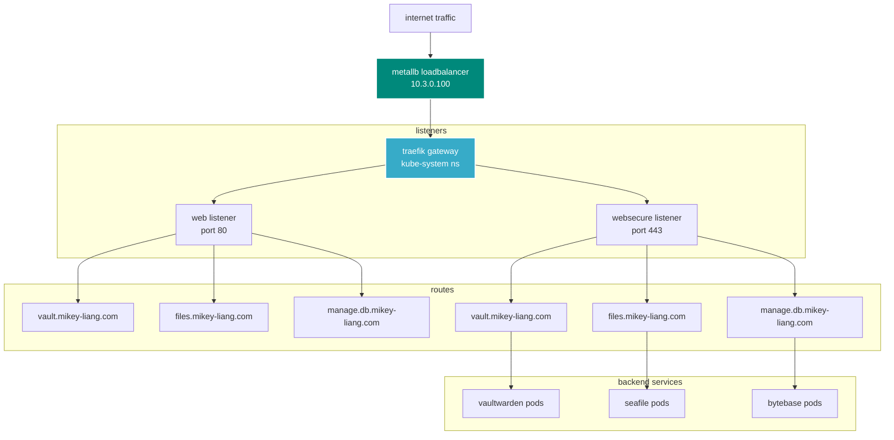
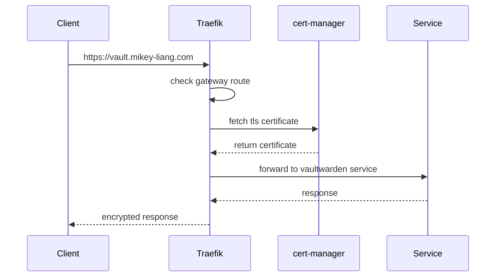

# traefik gateway

> kubernetes gateway api ingress controller with automatic tls termination

## 📋 overview

traefik serves as the main entry point for all external traffic into the cluster, using the kubernetes gateway api for modern routing and let's encrypt for automatic tls certificates.

### architecture



## 🚀 deployment

### prerequisites

- metallb installed and configured
- cert-manager installed for tls certificates

### install traefik

```bash
# add helm repo
helm repo add traefik https://traefik.github.io/charts
helm repo update

# install in kube-system namespace
helm install traefik traefik/traefik \
  --namespace kube-system \
  -f values.yaml
```

### verify installation

```bash
# check deployment
kubectl get pods -n kube-system -l app.kubernetes.io/name=traefik

# check loadbalancer ip
kubectl get svc -n kube-system traefik

# expected: external-ip = 10.3.0.100
```

## 🔧 configuration

### entrypoints

| name | port | protocol | nodeport | purpose |
|------|------|----------|----------|---------|
| web | 80 | http | 30000 | http traffic, redirects to https |
| websecure | 443 | https | 30001 | https traffic with tls termination |

### gateway listeners

```yaml
web:          # http listener for all namespaces
websecure:    # https listener with automatic tls
```

### dashboard access

**url:** `http://proxy.mikey-liang.com`

**authentication:**
- username: `admin`
- password: `traefik` (change in production!)

### middleware

**internal-only** - ip whitelist for internal services:
- tailscale: `100.64.0.0/10`
- vlan 30: `10.3.0.0/24` (app infra)
- vlan 31: `10.3.10.0/24` (app db)
- vlan 32: `10.3.20.0/24` (app internal)
- vlan 33: `10.3.30.0/24` (app external)

## 📊 traffic flow



## 🔒 security

### tls termination

- automatic tls certificate management via cert-manager
- certificates referenced in gateway listener
- all http traffic can be redirected to https

### authentication

- dashboard protected by basic auth
- middleware support for additional auth layers
- ip whitelisting for internal services

## 📝 creating routes

### using gateway api (httproute)

```yaml
apiVersion: gateway.networking.k8s.io/v1
kind: HTTPRoute
metadata:
  name: my-app-route
  namespace: app-internal
spec:
  parentRefs:
    - name: traefik-gateway
      namespace: kube-system
  hostnames:
    - "myapp.mikey-liang.com"
  rules:
    - matches:
        - path:
            type: PathPrefix
            value: /
      backendRefs:
        - name: my-app-service
          port: 80
```

### with tls certificate

```yaml
apiVersion: gateway.networking.k8s.io/v1
kind: HTTPRoute
metadata:
  name: my-app-route
spec:
  parentRefs:
    - name: traefik-gateway
      namespace: kube-system
      sectionName: websecure
  # ... rest of config
```

## 🛠️ operations

### view logs

```bash
# access logs
kubectl logs -n kube-system -l app.kubernetes.io/name=traefik -f

# specific pod
kubectl logs -n kube-system traefik-<pod-id>
```

### check routes

```bash
# list all httproutes
kubectl get httproute -A

# describe specific route
kubectl describe httproute <route-name> -n <namespace>
```

### dashboard

```bash
# port-forward to dashboard
kubectl port-forward -n kube-system svc/traefik 9000:9000

# access at http://localhost:9000/dashboard/
```

## 🔄 upgrading

```bash
# update helm repo
helm repo update

# upgrade traefik
helm upgrade traefik traefik/traefik \
  --namespace kube-system \
  -f values.yaml

# check rollout
kubectl rollout status deployment/traefik -n kube-system
```

## 📈 monitoring

### metrics

traefik exposes prometheus metrics on port 9100:

```bash
# check metrics
kubectl port-forward -n kube-system svc/traefik 9100:9100
curl http://localhost:9100/metrics
```

### health checks

```bash
# readiness probe
curl http://<traefik-pod-ip>:9000/ping

# liveness probe
kubectl get pods -n kube-system -l app.kubernetes.io/name=traefik
```

## 🐛 troubleshooting

### route not working

```bash
# check gateway status
kubectl get gateway -n kube-system

# check httproute status
kubectl describe httproute <route-name> -n <namespace>

# check traefik logs
kubectl logs -n kube-system -l app.kubernetes.io/name=traefik --tail=100
```

### loadbalancer pending

```bash
# check metallb configuration
kubectl get ipaddresspool -n metallb-system

# check service
kubectl describe svc traefik -n kube-system
```

### certificate issues

```bash
# check certificate status
kubectl get certificate -n <namespace>

# check cert-manager logs
kubectl logs -n cert-manager -l app=cert-manager
```

## 📚 resources

- [traefik documentation](https://doc.traefik.io/traefik/)
- [kubernetes gateway api](https://gateway-api.sigs.k8s.io/)
- [metallb integration](https://metallb.universe.tf/)

